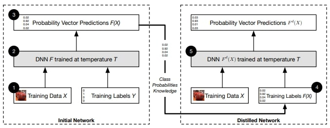
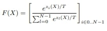
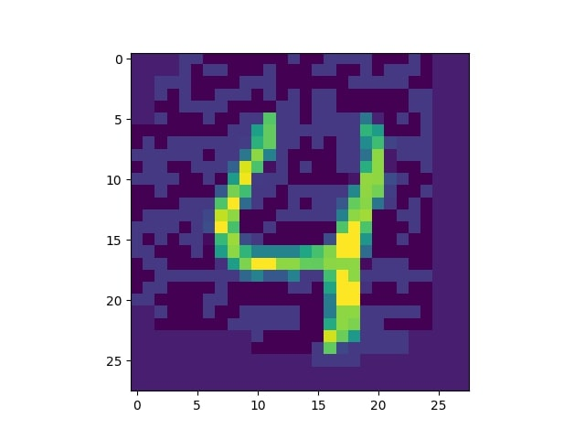

# Defensive Distillation
Defensive Distillation implementation based on the paper **Distillation as a Defense to Adversarial Perturbations against Deep Neural Networks**

## Overview

Defensive distillation is a technique used in machine learning to protect models from adversarial attacks. It was introduced in the paper Distillation as a Defense to Adversarial Perturbations against Deep Neural Networks in 2016 as a defense mechanism against adversarial examples, which are carefully crafted inputs designed to fool machine learning models. The goal of defensive distillation is to make the model more robust by training it on perturbed data generated from the original training set.

## Purpose

The primary purpose of defensive distillation is to enhance the resilience of machine learning models to adversarial attacks. By training a model on perturbed data, it learns to be more robust and generalizes better to unseen examples. Defensive distillation is particularly effective against adversarial examples generated using gradient-based attacks, where small, carefully crafted perturbations are added to input samples to mislead the model's predictions.

## How It Works

Defensive distillation involves two main steps: the initial model training and the distilled model training.

1. **Initial Model Training:** In the first step, a model (often a neural network) is trained on a large dataset using standard techniques such as supervised learning. This model is referred to as the "teacher" model and serves as the basis for the distilled model.

2. **Distilled Model Training:** In the second step, the teacher model is used to generate perturbed or "distilled" examples by adding small random noise to the original training set. The teacher model's softmax outputs are used as soft labels to train a new model, known as the "student" model. The student model is trained to mimic the teacher model's predictions, essentially learning from its knowledge.

3. **Inference with the Student Model:** Once the student model is trained, it can be used for inference on new, unseen examples. The distilled model aims to generalize better and be more robust to adversarial attacks compared to the original model.

## Soft Labels Formula with Temperature T

**T is set to 40 based on the paper**

## Implementation

Implementing defensive distillation involves the following steps:

1. Prepare a large labeled dataset for training the initial teacher model.
2. Train the teacher model using standard machine learning techniques suitable for the task at hand.
3. Generate perturbed examples by applying small random noise to the original training set using the trained teacher model.
4. Train the student model using the perturbed examples and the soft labels obtained from the teacher model.
5. Fine-tune the student model using the original training set to further enhance its performance if necessary.

It's important to note that the hyperparameters used in defensive distillation can significantly impact the effectiveness of the technique and may require careful tuning.

## Model Architecure
Architecture Layers

This is a breakdown of the layers in a Convolutional Neural Network (CNN) architecture:

1. **conv1**: Convolutional layer with 32 filters, a kernel size of (3, 3), and ReLU activation. Input shape: 28x28x1 (grayscale images).

2. **maxpool1**: Max pooling layer with a pool size of (2, 2). Reduces spatial dimensions by a factor of 2.

3. **conv2**: Convolutional layer with 64 filters, a kernel size of (3, 3), and ReLU activation.

4. **maxpool2**: Max pooling layer with a pool size of (2, 2). Further reduces spatial dimensions.

5. **flatten**: Flattens the output from the previous layer into a 1D vector.

6. **fc1**: Fully connected (dense) layer with 128 units and ReLU activation.

7. **fc2**: Final fully connected layer with 10 units, representing output classes, and softmax activation for obtaining class probabilities.

## Inference

### Trained on MNIST Dataset

This section provides information about training a model on the MNIST dataset and evaluating its performance with and without distillation.

### Accuracy

- Accuracy without distillation: **98.4%**
- Accuracy with distillation: **97.1%**

The model achieved an accuracy of 98.4% on the MNIST dataset without applying any defensive distillation techniques. However, after applying defensive distillation, the accuracy slightly decreased to 97.1%.

### FGSM Attack on Test Sample

The trained model was tested with an adversarial sample generated using the Fast Gradient Sign Method (FGSM) attack on a test sample from the MNIST dataset. The attacked sample is displayed below:

### Predictions

The predictions of the model, both with and without distillation, are as follows:

- Model without distillation on unattacked data: **4**
- Model without distillation on attacked data: **9**
- Model with distillation on attacked data: **4**

Even though the model without distillation misclassified the attacked sample as a **9**, the model with distillation correctly identified the digit as a **4**. This showcases the effectiveness of defensive distillation in improving the model's robustness against adversarial attacks.

Please note that the provided information is specific to the mentioned models and dataset. Results may vary for different models, datasets, and attack scenarios.

## References

If you would like to learn more about the concepts and techniques discussed in this README, you may find the following resources helpful:

- Nicolas Papernot, Patrick McDaniel, Xi Wu, Somesh Jha, Ananthram Swami (2016). "Distillation as a Defense to Adversarial Perturbations against Deep Neural Networks". In IEEE Symposium on Security and Privacy.

- TensorFlow documentation: [https://www.tensorflow.org/](https://www.tensorflow.org/)

- MNIST dataset: [http://yann.lecun.com/exdb/mnist/](http://yann.lecun.com/exdb/mnist/)

- Ian Goodfellow, Jonathon Shlens, Christian Szegedy (2015). "Explaining and Harnessing Adversarial Examples". In International Conference on Learning Representations (ICLR).

Please refer to these resources for in-depth information and further reading.

